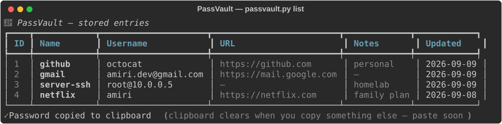

<div align="center">

# 🔐 PassVault

**An encrypted, offline-first password manager that lives in your terminal.**

No cloud. No accounts. No plaintext secrets on disk. Ever.




</div>

---

## ✨ Features

- 🔒 **Authenticated encryption** — every password is sealed with Fernet (AES-128-CBC + HMAC-SHA256); tampered data is rejected
- 🧂 **Key stretching** — the master password is stretched with PBKDF2-HMAC-SHA256 at **600,000 iterations**
- 🎲 **Secure password generator** — CSPRNG (`secrets`), guaranteed character classes, configurable length, look-alike character filtering (`Il1O0`)
- 📋 **One-command copy** — retrieve a password straight to your clipboard without printing it
- 🗄️ **Local SQLite storage** — metadata searchable, secrets always encrypted at rest
- 🖥️ **Beautiful rich TUI** — tables, colors and strength meters in any modern terminal
- 🧪 **Tested** — 10 unit tests covering crypto round-trips, tampering, and storage

## 🚀 Quickstart

```bash
git clone https://github.com/DeveloperAmiri/PassVault.git
cd PassVault
pip install -r requirements.txt
```

## 📖 Usage

```bash
# Create your vault (sets the master password)
python passvault.py init

# Add an entry with an auto-generated 22-char password
python passvault.py add github -u octocat --url https://github.com --generate --length 22

# Add an entry, typing the password yourself (hidden input)
python passvault.py add gmail -u you@example.com

# List all entries (metadata only — passwords stay encrypted)
python passvault.py list
python passvault.py list -s git        # search

# Retrieve a password (copies to clipboard, nothing printed)
python passvault.py get github
python passvault.py get github --show  # also print it to the terminal

# Delete an entry (asks for confirmation)
python passvault.py delete github

# Generate a one-off strong password
python passvault.py generate -n 24 --copy
```

**Output of `passvault.py list`:**

```
                         🔐 PassVault — stored entries
┏━━━━┳━━━━━━━━━━━━┳━━━━━━━━━━━━━━━━━━━━━┳━━━━━━━━━━━━━━━━━━━━━━━━━┳━━━━━━━━━━━┳━━━━━━━━━━┓
┃ ID ┃ Name       ┃ Username            ┃ URL                     ┃ Notes     ┃ Updated  ┃
┡━━━━╇━━━━━━━━━━━━╇━━━━━━━━━━━━━━━━━━━━━╇━━━━━━━━━━━━━━━━━━━━━━━━━╇━━━━━━━━━━━╇━━━━━━━━━━┩
│  1 │ github     │ octocat             │ https://github.com      │ personal  │ 2026-09… │
│  2 │ gmail      │ you@example.com     │ https://mail.google.com │ —         │ 2026-09… │
└────┴────────────┴─────────────────────┴─────────────────────────┴───────────┴──────────┘
```

## 🛡️ How it works

```
master password ──PBKDF2-HMAC-SHA256 (600k iters, random salt)──▶ Fernet key
                                                                      │
entry password ─────────────Fernet encrypt (AES-128-CBC + HMAC)──────▶ vault.db
```

- A random **16-byte salt** is generated on `init` and stored beside the DB — so two vaults with the same master password still produce different keys.
- A **verifier** token is stored encrypted; unlocking fails fast on a wrong master password without ever storing it.
- The **database file contains zero plaintext passwords** — even a stolen `vault.db` is useless without the master password.

## 📁 Project structure

```
PassVault/
├── passvault.py          # entry point
├── passvault/
│   ├── crypto.py         # PBKDF2 + Fernet helpers
│   ├── db.py             # SQLite storage layer
│   ├── generator.py      # secure password generator + strength meter
│   └── cli.py            # argparse + rich CLI
├── tests/                # pytest suite
└── screenshots/          # terminal captures
```

## ⚠️ Honest disclaimer

PassVault is a portfolio project demonstrating solid crypto engineering practices. For your most critical secrets, consider audited managers like Bitwarden or KeePassXC — and **never lose your master password**, because it cannot be recovered.

## 📄 License

Released under the [MIT License](LICENSE) — © 2026 DeveloperAmiri
